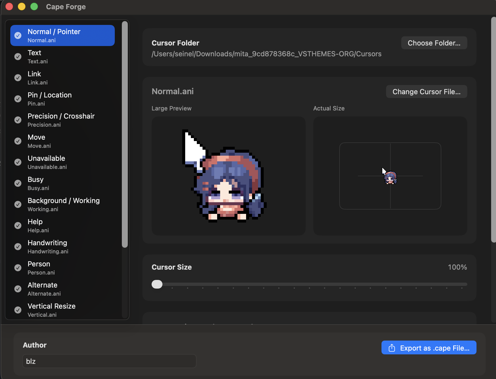

# Cape Forge

[한국어 README](README.ko.md)

Cape Forge is a macOS app that converts Windows cursor files and cursor packs (`.cur`, `.ani`) into Mousecape-compatible `.cape` files.

The screenshot above is an example of Cape Forge with a custom cursor pack loaded. Special thanks to **blz** for creating the wonderful pixel cursor artwork used in this example. Source: [BLZ_pixel on X](https://x.com/BLZ_pixel/status/1873630058981835066)

## Important Mousecape Notice

Cape Forge creates `.cape` files. To actually apply those cursor themes on macOS, you need Mousecape or another app that can apply `.cape` files.

On **macOS Tahoe and later**, cursor themes may not work with the original Mousecape app. Tahoe users should use the Tahoe-compatible Mousecape build here:

[Mousecape-TahoeSupport releases](https://github.com/AdamWawrzynkowskiGF/Mousecape-TahoeSupport/releases)

For macOS versions before Tahoe, the original [Mousecape](https://github.com/alexzielenski/Mousecape) may still be enough.

## What It Does

- Loads `.cur` and `.ani` cursor files from a folder
- Automatically maps common cursor roles
- Lets you preview each cursor before export, including animated cursors
- Lets you replace individual cursor roles manually
- Lets you adjust the exported cursor size
- Supports drag and drop for both cursor folders and individual cursor files
- Leaves additional Mousecape cursor slots on the macOS default cursor unless you assign them yourself
- Downsamples long animated cursors to improve Mousecape compatibility
- Exports a `.cape` file for use with Mousecape

## How To Use

1. Open Cape Forge.
2. Click `Choose Folder...` and select a folder that contains `.cur` or `.ani` files.
3. Review the mapped cursor roles in the sidebar.
4. If needed, select a role and click `Change Cursor File...` to replace it manually.
5. Enter an author name.
6. Optionally adjust the export size.
7. Click `Export as .cape File...`.
8. Open the exported `.cape` file in Mousecape and apply it there.

## Tips

- Cursor packs with common names like `Normal`, `Text`, `Link`, `Busy`, and resize cursors tend to map best.
- Additional cursors are optional. By default they stay on the macOS default cursor unless you assign them yourself.
- Animated `.ani` cursors play in the preview so you can check motion before exporting.
- You can drag and drop a cursor folder into the app to load it.
- You can also drag and drop a single `.cur` or `.ani` file onto the app to replace the currently selected cursor role.
- Animated cursors with more than 24 frames are exported as balanced 24-frame versions to avoid Mousecape apply issues.

## Requirements

- macOS Sequoia 15.6 or later
- Mousecape, if you want to apply the exported `.cape` file as your system cursor theme
- On macOS Tahoe or later: the Tahoe-compatible Mousecape build linked above
